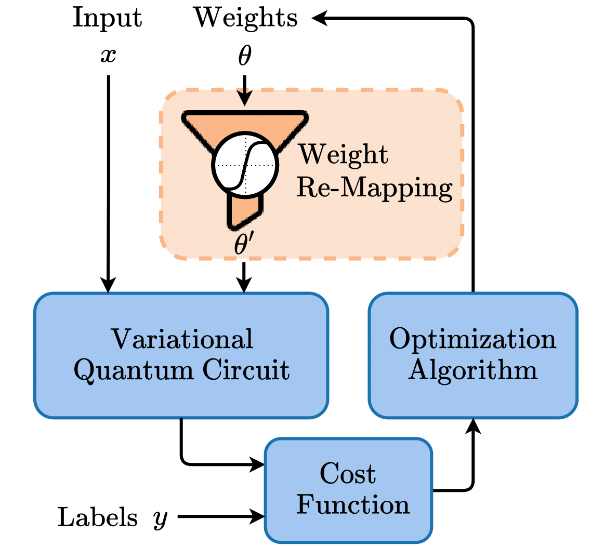
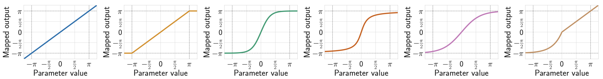

# [qW-Map: Weight Re-Mapping for Variational Quantum Circuits](https://arxiv.org/abs/2212.14807)

A PyTorch implementation of Quantum Weight Re-Mapping



In recent years, quantum machine learning has seen a substantial increase in the use of variational quantum circuits (VQCs). VQCs are inspired by artificial neural networks, which achieve extraordinary performance in a wide range of AI tasks as massively parameterized function approximators. VQCs have already demonstrated promising results, for example, in generalization and the requirement for fewer parameters to train, by utilizing the more robust algorithmic toolbox available in quantum computing. A VQCs' trainable parameters or weights are usually used as angles in rotational gates and current gradient-based training methods do not account for that. We introduce weight re-mapping for VQCs, to unambiguously map the weights to an interval of length $2\pi$, drawing inspiration from traditional ML, where data rescaling, or normalization techniques have demonstrated tremendous benefits in many circumstances. We employ a set of five functions and evaluate them on the Iris and Wine datasets using variational classifiers as an example. Our experiments show that weight re-mapping can improve convergence in all tested settings. Additionally, we were able to demonstrate that weight re-mapping increased test accuracy for the Wine dataset by $10\%$ over using unmodified weights.

[Link to Arxiv Paper](https://arxiv.org/abs/2212.14807)

## Implemented Functions



## Install

```
$ pip install qw-map
```

## Example:

```python
import pennylane as qml
from qw_map import tanh
from torch import Tensor

def circuit(ws: Tensor, x: Tensor):
	qml.AngleEmbedding(x, rotation='X', wires=range(num_qubits))
        qml.StronglyEntanglingLayers(tanh(ws), wires=range(num_qubits))
```

## Citation

TODO
